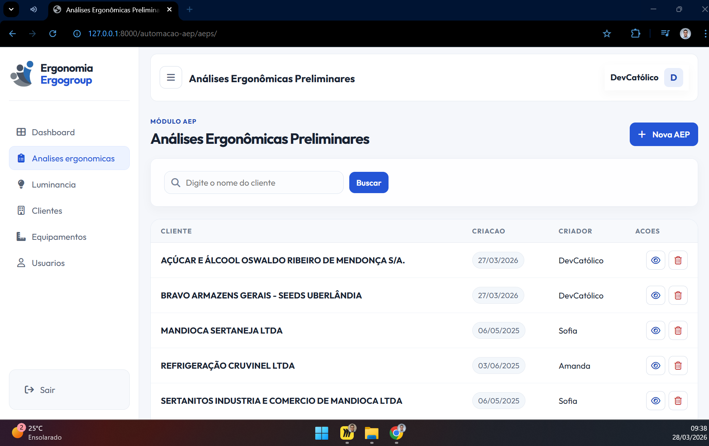

Sistema técnico-operacional desenvolvido para automatizar a criação e gestão de relatórios de ergonomia na área de Saúde e Segurança do Trabalho (SST), incluindo Análises Ergonômicas Preliminares (AEP) e relatórios de iluminância.

## Visão Geral

A solução foi projetada para transformar um processo manual, repetitivo e altamente dependente de documentos em um fluxo estruturado, padronizado e escalável dentro de uma única plataforma.

O sistema permite que profissionais técnicos realizem análises, registrem dados e gerem relatórios completos de forma automatizada, reduzindo significativamente o tempo operacional e aumentando a consistência das entregas.

---

## Problema

A elaboração de relatórios técnicos na área de ergonomia e SST — especialmente **Análises Ergonômicas Preliminares (AEP)** e **avaliações de iluminância** — era realizada de forma manual, com:

- Alto esforço operacional na coleta e organização de dados
- Baixa padronização entre relatórios
- Risco elevado de inconsistências técnicas
- Tempo excessivo para geração de documentos

Cada tipo de análise possuía suas particularidades, exigindo estruturas diferentes de coleta, interpretação e documentação, o que aumentava ainda mais a complexidade do processo.

Esse cenário limitava a produtividade da equipe, dificultava a padronização técnica e tornava a operação pouco escalável.

---

## Solução

Desenvolvi uma plataforma que centraliza e estrutura todo o processo de análises técnicas em ergonomia e SST, atendendo especificamente dois fluxos críticos da operação: **Análises Ergonômicas Preliminares (AEP)** e **avaliações de iluminância**.

A aplicação organiza a coleta de dados conforme o tipo de análise, aplica regras de negócio específicas de cada contexto e automatiza a geração de relatórios técnicos padronizados.

Cada fluxo foi modelado de forma independente, respeitando suas particularidades, mas dentro de uma mesma base arquitetural, permitindo:

- Reutilização de estrutura e componentes
- Padronização dos outputs técnicos
- Redução de complexidade operacional
- Escalabilidade para novos tipos de análises no futuro

Com isso, o sistema transforma um processo manual e fragmentado em um fluxo digital estruturado, consistente e orientado à produtividade.

---

## Principais Funcionalidades

- Gestão completa de **Análises Ergonômicas Preliminares (AEP)**
- Gestão de **avaliações de iluminância**, com estrutura própria de coleta e análise
- Geração automatizada de relatórios técnicos a partir dos dados coletados
- Cadastro e organização de clientes, ambientes e contextos de análise
- Estruturação dos dados conforme exigências técnicas da área de SST
- Padronização dos relatórios, garantindo consistência entre diferentes análises
- Separação de fluxos por tipo de análise (AEP e iluminância), respeitando suas particularidades
- Interface orientada à produtividade, reduzindo esforço operacional do profissional técnico

---

## Arquitetura e Decisões Técnicas

- Backend desenvolvido em **Django**, com organização orientada a domínio, separando claramente as responsabilidades entre clientes, análises e geração de relatórios
- Estrutura modular que permite evolução independente dos diferentes tipos de análise (AEP e iluminância)
- Modelagem de dados focada em representar entidades técnicas da ergonomia e suas variações conforme o tipo de análise
- Centralização das regras de negócio no backend, garantindo consistência na aplicação das regras técnicas e redução de dependência da interface
- Implementação de geração de relatórios baseada em templates dinâmicos, permitindo transformar dados estruturados em documentos técnicos padronizados
- Uso de banco relacional (**MySQL**) com foco em integridade e rastreabilidade das informações coletadas

---

## Desafios

O principal desafio do projeto não esteve na modelagem do sistema, mas na **geração de relatórios técnicos com fidelidade total ao formato exigido pelo cliente**.

Os documentos precisavam reproduzir exatamente o padrão utilizado anteriormente em Word e Excel, incluindo:

- Estrutura de tabelas complexas
- Mesclagem de células (horizontal e vertical)
- Rotação de texto em células (texto vertical)
- Estilização específica, como cores de bordas e formatação detalhada

Para atender a esse nível de exigência, foi necessário ir além do uso convencional da biblioteca `python-docx`, manipulando diretamente o **XML dos documentos (.docx)** para implementar comportamentos não suportados nativamente pela biblioteca.

Esse processo exigiu:

- Entendimento da estrutura interna do formato `.docx` (OpenXML)
- Manipulação manual de elementos XML
- Testes iterativos para validação visual dos documentos gerados

---

## Impacto

- Redução significativa no tempo de criação de relatórios técnicos, transformando um processo manual em geração automatizada
- Padronização dos documentos, garantindo consistência técnica entre diferentes análises (AEP e iluminância)
- Diminuição de erros operacionais decorrentes de preenchimento manual e retrabalho
- Aumento da capacidade produtiva da equipe técnica, permitindo maior volume de entregas com o mesmo esforço

---

## Aprendizados

Esse projeto consolidou minha capacidade de:

- Traduzir processos técnicos da área de SST em fluxos digitais estruturados
- Modelar domínios específicos com variações de comportamento (AEP e iluminância) dentro de uma mesma arquitetura
- Trabalhar com geração dinâmica de documentos a partir de dados estruturados
- Atuar além das limitações de bibliotecas, manipulando diretamente estruturas de baixo nível (XML do `.docx`) para atender requisitos reais de negócio
- Desenvolver soluções orientadas à produtividade e escalabilidade operacional

---

## Stack

- Python / Django
- MySQL
- HTML / CSS / JavaScript
- Geração de documentos com `python-docx` (incluindo manipulação direta de XML - OpenXML)
