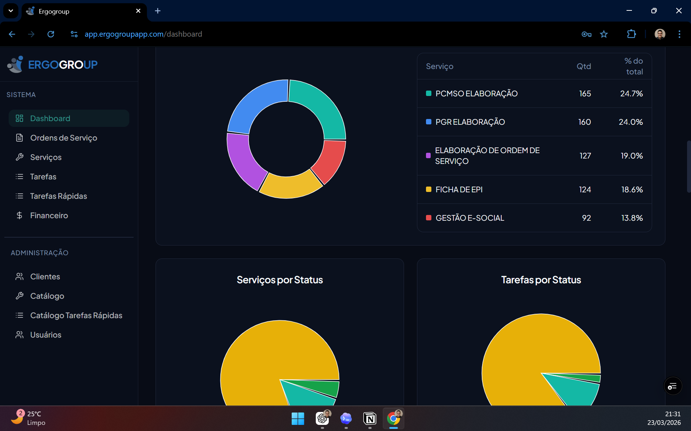

Sistema ERP desenvolvido para centralizar e organizar os processos de vendas, operação e financeiro da empresa, estruturando rotinas e garantindo maior controle sobre a execução dos serviços.

## Problema

Ao ingressar na empresa, identifiquei um processo descentralizado entre os setores de vendas, execução de serviços e faturamento.

Cada área operava com planilhas próprias em Excel, sem integração entre si, enquanto a comunicação ocorria de forma informal, principalmente por e-mail.

Esse cenário gerava retrabalho, inconsistência de informações e dificuldade no controle e acompanhamento das operações.

## A solução

Para resolver a descentralização dos processos, desenvolvi um sistema que unifica toda a operação da empresa, desde a venda até a execução dos serviços e o faturamento.

A proposta foi construir uma solução que refletisse fielmente a estrutura operacional existente, reduzindo a fricção na adoção e garantindo que cada setor pudesse trabalhar dentro do sistema de forma natural, sem a necessidade de adaptação forçada.

### Modelagem de domínio

Estruturei o domínio da aplicação e o banco de dados com base nas áreas principais da operação:

- Comercial
- Área Técnica
- Financeiro

Cada módulo foi projetado com responsabilidades bem definidas, espelhando diretamente o funcionamento da empresa.

### Comercial

O fluxo se inicia no setor comercial, responsável pelo cadastro dos serviços vendidos. Após o registro, os serviços são automaticamente encaminhados para o setor técnico, iniciando o processo de execução.

Também foi implementada a possibilidade de faturamento imediato para determinados tipos de serviço, permitindo que a cobrança e a emissão da nota fiscal ocorram no momento da venda, conforme regras específicas do negócio.

### Área Técnica

No setor técnico, os serviços são recebidos e distribuídos pelos responsáveis da área, que associam tarefas aos técnicos.

Uma regra de negócio importante foi implementada: ao concluir todas as tarefas vinculadas, o serviço é automaticamente finalizado. Isso garante consistência no fluxo e reduz a necessidade de intervenções manuais.

### Financeiro

Após a execução, os serviços seguem para o setor financeiro, responsável pelo faturamento, cobrança e emissão de notas fiscais.

O sistema também contempla integração com emissão de notas, centralizando todo o processo financeiro dentro da plataforma.

---

Como resultado, a empresa passou a operar de forma integrada, com maior controle sobre os processos, redução de retrabalho e maior previsibilidade na execução das rotinas.

## Como o sistema funciona

O sistema foi estruturado para acompanhar o fluxo completo da operação da empresa, conectando os setores comercial, técnico e financeiro dentro de uma única plataforma.

Tudo começa no módulo comercial, onde os serviços vendidos são cadastrados. A partir desse registro, o sistema direciona automaticamente cada serviço para o fluxo adequado, considerando as regras de negócio definidas para aquele tipo de atendimento.

No módulo técnico, os responsáveis pela operação recebem os serviços e distribuem as tarefas entre os técnicos. Conforme as tarefas são concluídas, o sistema acompanha a execução e aplica automações importantes, como a finalização automática do serviço quando todas as etapas vinculadas forem concluídas.

Após a execução, ou imediatamente após a venda nos casos previstos pela regra de negócio, o fluxo segue para o financeiro. Nessa etapa, o sistema centraliza cobrança, faturamento e emissão de nota fiscal, permitindo que todo o processo seja acompanhado de forma integrada, com mais controle, rastreabilidade e menos dependência de controles paralelos.

## Arquitetura e decisões técnicas

A arquitetura do sistema foi estruturada com foco na centralização das regras de negócio, garantindo consistência entre os diferentes setores e reduzindo a dependência de validações manuais.

O backend foi desenvolvido utilizando Django, com organização orientada a domínio, separando responsabilidades entre os módulos comercial, técnico e financeiro. Essa divisão permitiu manter o sistema coeso, mas ao mesmo tempo desacoplado o suficiente para evoluções futuras.

A modelagem do banco de dados foi pensada para refletir diretamente o fluxo operacional da empresa, permitindo rastrear cada serviço desde a venda até o faturamento, mantendo histórico e integridade das informações ao longo de todo o processo.

Algumas decisões importantes foram tomadas para garantir a confiabilidade do sistema, como a implementação de regras automáticas de transição de estado (ex: finalização automática de serviços a partir da conclusão das tarefas) e o tratamento de diferentes fluxos de faturamento, incluindo cenários de cobrança imediata e pós-execução.

Além disso, integrei o sistema com serviços externos para emissão de notas fiscais, centralizando toda a operação financeira dentro da plataforma e reduzindo a necessidade de ferramentas paralelas.

## Desafios e decisões

Um dos principais desafios foi estruturar regras de negócio que refletissem com precisão a operação da empresa, garantindo que o sistema fosse fiel à realidade sem se tornar rígido ou difícil de evoluir.

A modelagem do fluxo entre os setores também exigiu decisões cuidadosas, principalmente na definição de estados e transições dos serviços, equilibrando automação com flexibilidade para diferentes cenários operacionais.

Outro ponto relevante foi lidar com múltiplos fluxos de faturamento, incluindo casos de cobrança imediata e pós-execução, o que exigiu uma modelagem consistente para evitar inconsistências e retrabalho.

Além disso, busquei manter o sistema desacoplado o suficiente para permitir evolução contínua, sem comprometer a centralização das regras de negócio, que eram essenciais para a consistência da operação.

## Impacto

A implementação do sistema trouxe maior organização e integração entre os setores da empresa, eliminando a dependência de planilhas isoladas e centralizando a operação em uma única plataforma.

Com isso, houve redução de retrabalho, melhoria no controle das atividades e maior visibilidade sobre o andamento dos serviços, desde a venda até o faturamento.

O sistema também estabeleceu uma base estruturada para o crescimento da empresa, permitindo maior previsibilidade nas rotinas operacionais e facilitando a tomada de decisão.

## Aprendizados

Esse projeto reforçou a importância de entender profundamente o contexto do negócio antes de propor soluções técnicas, garantindo que o sistema realmente resolva o problema e não apenas o substitua.

Aprofundei minha experiência em modelagem de regras de negócio, organização de domínio e tomada de decisões arquiteturais voltadas para sistemas reais em produção.

Além disso, tive a oportunidade de evoluir minha visão de produto, entendendo como diferentes áreas da empresa se conectam e como o software pode atuar como um ponto central de organização da operação.

### Stack

- Python / Django
- React/TypeScript
- MySQL
- Integração com APIs de emissão de nota fiscal
