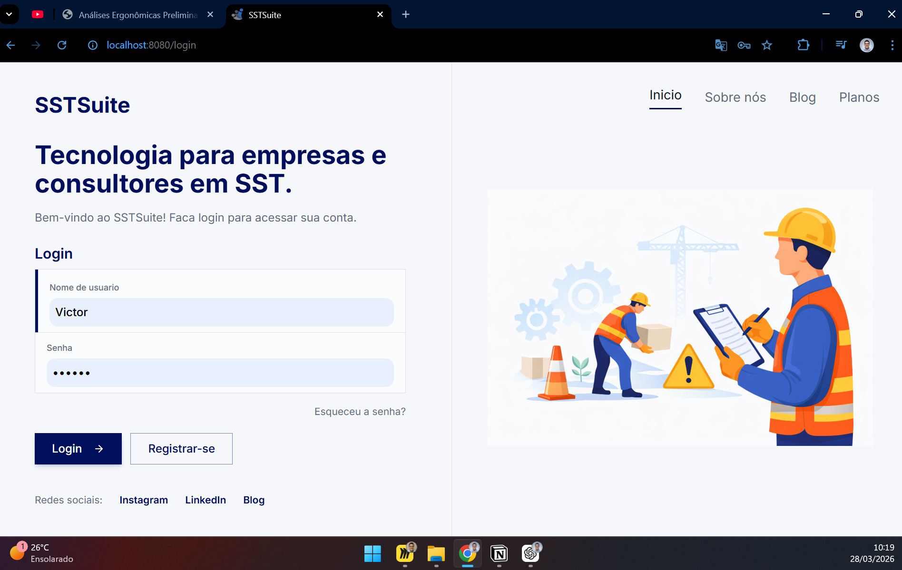

Plataforma SaaS para a área de Saúde e Segurança do Trabalho (SST), voltada à execução de avaliações técnicas, análise de dados de riscos ocupacionais e automação da geração de documentos técnicos.

---

## Visão do Produto

O SSTSuite foi concebido como uma plataforma central para estruturar e escalar operações na área de Saúde e Segurança do Trabalho (SST), conectando avaliações técnicas, análise de dados e geração de documentos dentro de um fluxo único e integrado.

A solução permite que empresas realizem avaliações ocupacionais de forma estruturada, registrem e analisem riscos identificados e transformem essas informações em documentos técnicos padronizados, reduzindo a dependência de processos manuais e ferramentas isoladas.

Além disso, a plataforma foi projetada com foco em evolução contínua, permitindo a inclusão de novos tipos de avaliações e regras de negócio conforme a complexidade da operação cresce.

---

## Problema

Empresas da área de Saúde e Segurança do Trabalho (SST) lidam com processos altamente técnicos que, na prática, ainda são executados de forma manual e descentralizada.

Avaliações ocupacionais, identificação de riscos e geração de documentos costumam ser realizadas com apoio de planilhas, documentos isolados e ferramentas não integradas, o que gera:

- Falta de padronização na execução das avaliações técnicas
- Dificuldade em estruturar e analisar os dados de riscos ocupacionais
- Baixa rastreabilidade das informações ao longo do tempo
- Alto esforço operacional na elaboração de documentos técnicos
- Dependência de processos manuais e repetitivos

Esse cenário reduz a eficiência da operação e dificulta a escalabilidade das empresas, principalmente à medida que aumenta o volume de análises e clientes atendidos.

---

## Solução

O SSTSuite foi desenvolvido para estruturar e centralizar os principais processos da operação em SST, conectando avaliações técnicas, análise de riscos e geração de documentos em um único fluxo integrado.

A plataforma permite que as avaliações sejam realizadas de forma padronizada, com os dados sendo registrados de maneira estruturada e utilizados diretamente na análise dos riscos ocupacionais e na geração de documentos técnicos.

Com isso, o sistema reduz a dependência de controles paralelos, melhora a rastreabilidade das informações e automatiza etapas operacionais que antes eram manuais, aumentando a eficiência e a consistência das entregas.

Além disso, a solução foi projetada para acompanhar a evolução da operação, permitindo a inclusão de novos tipos de avaliações e regras de negócio sem comprometer a estrutura existente.

---

## Módulos do Sistema

Aqui você mostra visão de produto:

- Gestão de Clientes, Setores, Ghes e Funções
- Módulo de AEP (análise ergonômica preliminar - NHO-11)
- Módulo Iluminância - NHO 11
- Coleta de dados técnicos em campo
- Geração de Relatórios Técnicos
- Dashboard e análise de riscos ocupacionais
- Plano de ação
- Arquitetura mult-tenancy
- Assinaturas e Integração com gateway de pagamento

---

## Arquitetura e Decisões Técnicas

A arquitetura do SSTSuite foi pensada para sustentar a evolução contínua do produto, equilibrando organização de domínio, reaproveitamento de lógica e flexibilidade para expansão futura.

### Estrutura da aplicação

- Arquitetura orientada a domínio, com separação dos módulos conforme os contextos principais do negócio
- Backend centralizando as regras de negócio e a consistência dos fluxos da aplicação
- Modelagem de dados voltada para rastreabilidade das informações técnicas, avaliações realizadas e riscos identificados
- Estrutura organizada para evolução incremental do sistema, sem acoplamento excessivo entre os módulos
- Base arquitetural compatível com futura extração de serviços independentes, caso a complexidade do produto exija esse passo

### Extensibilidade das avaliações técnicas

Um dos pilares da arquitetura foi a construção de uma estrutura modular para suportar diferentes tipos de avaliações dentro da mesma plataforma.

As avaliações compartilham uma base comum de fluxo, persistência e organização, mas cada uma pode possuir suas próprias regras, campos, cálculos e geração documental. Essa abordagem permite introduzir novas avaliações técnicas no sistema com menor impacto sobre os módulos já existentes, preservando consistência arquitetural e reduzindo o custo de evolução do produto.

Na prática, isso transforma o SSTSuite em uma base reutilizável para expansão do domínio, em vez de uma aplicação rígida acoplada a poucos tipos de análise.

### Reaproveitamento de lógica no frontend

No frontend, a aplicação foi estruturada com uma arquitetura baseada em hooks e composição de responsabilidades, separando a lógica de estado, regras de interação e integração com a interface visual.

Essa abordagem permite encapsular comportamentos reutilizáveis em hooks customizados, reduzindo duplicação e facilitando manutenção. Além disso, essa separação cria um caminho mais favorável para reaproveitamento da lógica em uma futura aplicação **React Native**, já que parte relevante das regras de interação e consumo de dados pode ser abstraída da camada de apresentação e adaptada para diferentes interfaces.

Com isso, o sistema ganha não apenas organização no frontend atual, mas também uma base mais estratégica para evolução multiplataforma.

---

## Diferencial

- Plataforma construída a partir de problemas reais da área de SST, refletindo o fluxo técnico e operacional da prática
- Integração entre execução de avaliações, análise de riscos e geração de documentos em um único sistema
- Geração automatizada de documentos técnicos complexos a partir de dados estruturados
- Arquitetura modular que permite evolução contínua e inclusão de novos tipos de avaliações
- Estrutura concebida como produto SaaS, com foco em escalabilidade e reutilização

---

## Impacto

- Redução do retrabalho operacional na execução de avaliações e geração de documentos
- Padronização dos processos técnicos, garantindo maior consistência nas entregas
- Centralização das informações da operação em uma única plataforma
- Base estruturada para crescimento da operação sem aumento proporcional de esforço
- Melhoria na rastreabilidade dos dados técnicos e dos riscos identificados

---

## Aprendizados

Esse projeto consolidou minha capacidade de:

- Construir um produto SaaS completo, desde a concepção até a estruturação técnica
- Tomar decisões arquiteturais considerando evolução de longo prazo
- Modelar domínios complexos com diferentes tipos de avaliação dentro de uma mesma base
- Equilibrar requisitos de negócio, experiência do usuário e organização técnica
- Desenvolver soluções orientadas à produtividade e escalabilidade operacional

---

## Stack

- Python / Django
- MySQL
- React / TypeScript
- HTML / CSS / JavaScript
- Integração com geração de documentos (`python-docx`)
- Arquitetura baseada em módulos e organização orientada a domínio
